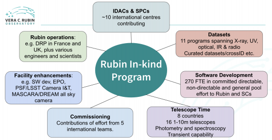

#####
About
#####

Forty-three international teams outside the U.S. and Chile are contributing to Rubin Observatory and LSST Science through the In-kind Program, in exchange for LSST data rights.
These contributions are recognized in the International Data Rights Holder list, which includes all individuals nominated by their respective international programs.

The In-kind Program spans a wide range of contributions—providing resources, expertise, and support to Rubin Operations and the broader Rubin Science Community.
The Rubin LSST Science Collaborations play a key role in supporting the CEC and In-kind Program Coordination (IPC) teams by offering scientific guidance and helping manage these contributions.

Oversight of the program is a collaborative effort led by the Program Managers (PMs) from each international partner.
Their work is facilitated by the Rubin IPC Team, which reports directly to the Rubin Director and Deputy Director of Operations.

If you have questions, please refer to the In-kind Program FAQs. You can also explore ongoing discussions and updates in the LSST Community Forum using the in-kind tag.

.. raw:: html

   

.. toctree::
   :maxdepth: 1

   mission
   history
   team

.. raw:: html

   

