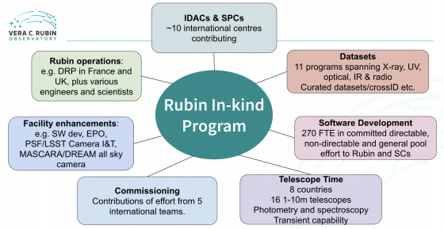

#############
Contributions
#############

The Vera C. Rubin Observatory In-Kind Program spans a wide range of contributions that international partners make to Rubin Observatory and the Rubin Science Community in exchange for LSST data rights -- from software development and telescope time to computing resources, datasets, and operational support.

Further information is available about the following contributions:

.. raw:: html

   

.. toctree::
   :maxdepth: 1

   general-pool
   contributed-datasets
   contributed-software
   contributed-telescope
   contributed-resources

.. raw:: html

   

